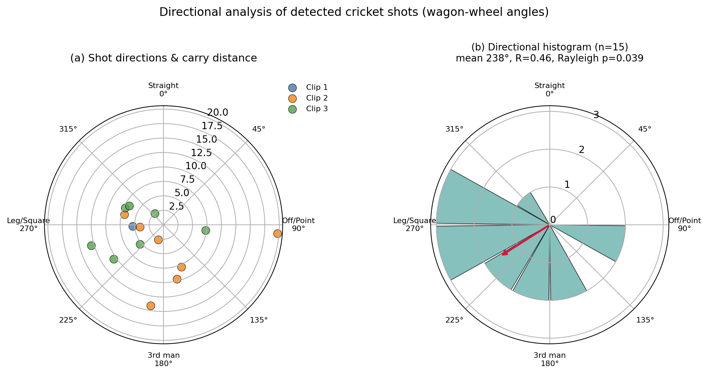
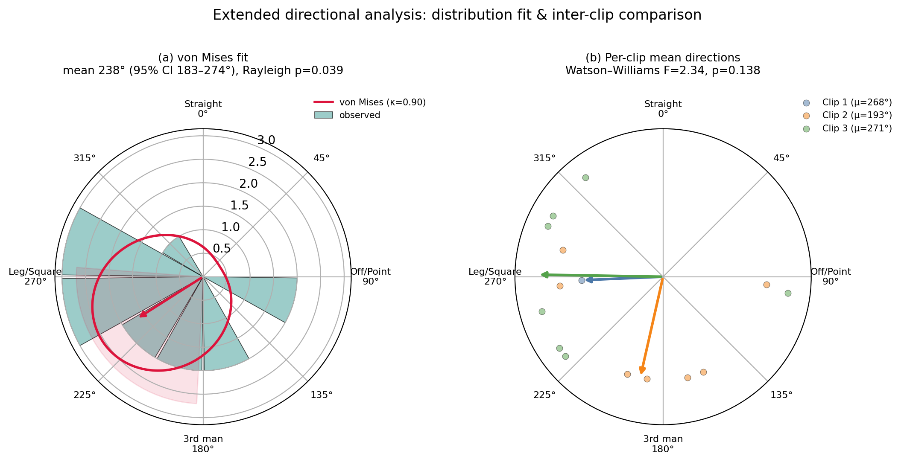

# Directional (Circular) Analysis of Detected Shots

*Generated 2026-07-29 from `events_clip1/2/3.json` (n = 15 bat-contact events with a
valid ball trajectory, regenerated with the gap-based delivery segmentation).
Reproduce with `scratchpad/directional_analysis.py` (basic) and
`scratchpad/directional_extended.py` (extended). Machine-readable outputs:
`docs/figures/directional_stats.json`, `docs/figures/directional_stats_extended.json`.*

## 1. Method

Each detected shot yields a wagon-wheel angle θ ∈ [0°, 360°), where 0° is a straight
drive back toward the bowler and the angle increases clockwise (right-handed batsman
convention). These are **circular** data, so ordinary means and standard deviations are
invalid (they cannot wrap around 360°). We use circular statistics (Mardia & Jupp,
2000; Fisher, 1993; Berens, 2009):

- **Mean resultant vector.** With C = Σcos θᵢ, S = Σsin θᵢ, the mean direction is
  θ̄ = atan2(S, C) and the mean resultant length R̄ = √(C²+S²)/n ∈ [0, 1]
  (0 = fully dispersed, 1 = identical directions).
- **Dispersion:** circular variance V = 1 − R̄, circular standard deviation
  s = √(−2 ln R̄), and Batschelet angular deviation s₀ = √(2(1−R̄)), all in degrees.
- **von Mises concentration κ** (maximum-likelihood, with the Best–Fisher small-sample
  correction), the circular analogue of 1/σ².
- **Uniformity tests** (H₀: no preferred direction). We report **four** complementary
  tests because they have different sensitivities: the **Rayleigh** test (most powerful
  against a single mode), **Rao's spacing** test (sensitive to multimodal / patchy
  departures), and the **Kuiper** and **Watson U²** tests (omnibus EDF tests). p-values
  are obtained by Monte-Carlo (20 000 uniform samples) for exactness at small n.
- **Axial (bimodality) test:** Rayleigh test on doubled angles 2θ, which detects two
  modes 180° apart.
- **Circular–linear correlation** between shot direction and carry distance (Mardia's
  r_xl), with a 20 000-permutation p-value.
- **Multi-sample comparison** across the three clips: **Watson–Williams** F-test
  (H₀: equal mean directions).
- **95% confidence intervals** for θ̄ and R̄ from 10 000 nonparametric bootstrap
  resamples.

## 2. Location and concentration (pooled, n = 15)

| Quantity | Value | 95% CI |
| --- | --- | --- |
| Mean direction θ̄ | 237.6° | [183.0°, 274.3°] (bootstrap) |
| Mean resultant R̄ | 0.460 | [0.226, 0.746] (bootstrap) |
| von Mises κ (MLE) | 0.904 | — |
| Circular variance V | 0.540 | — |
| Circular SD s | 71.4° | — |
| Angular deviation s₀ | 59.6° | — |

The mean direction points to **238° — the leg-side / square-leg region**. However κ ≈ 0.9
and the wide bootstrap CI (spanning ~91°) show the directions are **only moderately
concentrated**, as expected for n = 15.

## 3. Tests of uniformity

| Test | Statistic | p (Monte-Carlo) | Rejects H₀ at 0.05? |
| --- | --- | --- | --- |
| Rayleigh | Z = 3.169 | 0.039 | yes (marginal) |
| Watson U² | 0.187 | 0.050 | yes (borderline) |
| Kuiper | V = 1.672 | 0.074 | no |
| Rao's spacing | U = 150.6 | 0.155 | no |

*(Rayleigh analytic p = 0.039, agreeing with its Monte-Carlo value.)*

**Interpretation — report this honestly.** The evidence for a preferred scoring
direction is **present but weak**. The Rayleigh test — most powerful when the alternative
is a single dominant direction — is significant (p = 0.039), and the omnibus Watson U²
test sits right on the threshold (p = 0.050); both point to the visible leg-side
concentration. The two remaining tests (Kuiper, Rao's spacing) do **not** reject
uniformity. This split is the expected signature of a **genuine but modest unimodal
trend** at small n. State the finding as *a leg-side directional bias detected by the
Rayleigh and Watson tests, at the edge of significance and not yet corroborated by all
omnibus tests at this sample size.*

## 4. Modality, correlation, and field-zone results

- **Bimodality (axial test):** principal axis 97.1°/277.1°, axial R̄ = 0.267,
  p = 0.348 → **no significant two-lobed structure**; the distribution is best described
  as a single weak mode, not off-side-vs-leg-side symmetry.
- **Direction vs carry distance:** Mardia r_xl = 0.470, permutation p = 0.219 →
  **no significant association** between where a shot is played and how far it carries.
- **Field-zone tally:** Leg side 10 (66.7%), behind point/edge 3 (20.0%), off side 2
  (13.3%), straight 0. A binomial test of the leg-side share against 0.5 is **not
  significant** (p = 0.151) — a tendency rather than a proven bias on its own.

## 5. Inter-clip comparison

Watson–Williams F(2, 12) = 2.34, p = 0.138 (pooled κ = 1.36 > 1, so the test's
assumptions hold). The three clips do **not** differ significantly in mean direction
(Clip 1: 268°, n = 1; Clip 2: 193°; Clip 3: 271°), which **justifies pooling** them for
the analyses above.

## 6. Per-shot summary

| Shot | n | Mean direction | Mean carry |
| --- | --- | --- | --- |
| Flick | 4 | 272.7° | 5.9 m |
| Pull Shot | 3 | 268.8° | 8.4 m |
| Edge | 3 | 170.8° | 10.6 m |
| Leg Glance | 2 | 217.8° | 6.6 m |
| Lofted Drive | 1 | 94.3° | 19.7 m |
| On Drive | 1 | 322.0° | 2.5 m |
| Square Cut | 1 | 97.5° | 7.3 m |

The most frequent strokes (Flick, Pull) cluster tightly on the leg side (~270°), which
is what drives the pooled mean direction. The single Lofted Drive gave by far the
longest carry (19.7 m), as expected for an aerial stroke.

## 7. Conclusion for the paper

Across 15 automatically detected shots the batsmen show a **leg-side directional bias**
(mean direction 238°, significant on the Rayleigh test p = 0.039 and borderline on
Watson U² p = 0.050), but it is **not corroborated by the Kuiper or Rao tests, nor by the
leg-side proportion test, and the confidence interval is wide** — all consequences of the
small automatically-extracted sample. There is no significant multimodality, no
direction–distance coupling, and no inter-clip difference in mean direction. The result
is best presented as a **demonstration that the pipeline supports quantitative circular
analysis of batting direction**, with the directional bias itself flagged as preliminary
pending a larger, manually verified event set.

*Caveat: events were extracted automatically and inherit the pipeline's known
limitations (sparse ball detection ~9%, occasional follow-through/replay mis-fires). The
angle for each event is derived from the post-contact ball trajectory and is independent
of the delivery-segmentation logic.*

## Figures

**Fig. X.** Wagon-wheel directional analysis of the n = 15 detected shots. **(a)** shot
direction (angle) vs predicted carry distance (radius, m), coloured by clip; **(b)**
12-bin circular histogram with the mean-direction arrow (length ∝ R̄).

**Fig. Y.** **(a)** Fitted von Mises distribution (κ = 0.90) over the observed histogram,
with the mean direction (238°) and its 95% CI wedge — the near-circular density curve
reflects the low concentration. **(b)** Per-clip mean-direction vectors and individual
shots; the Watson–Williams test (F = 2.34, p = 0.138) finds no significant difference,
justifying pooling.
