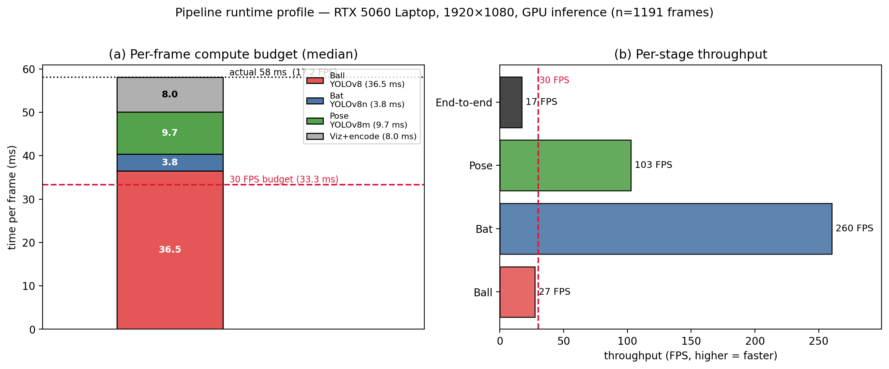
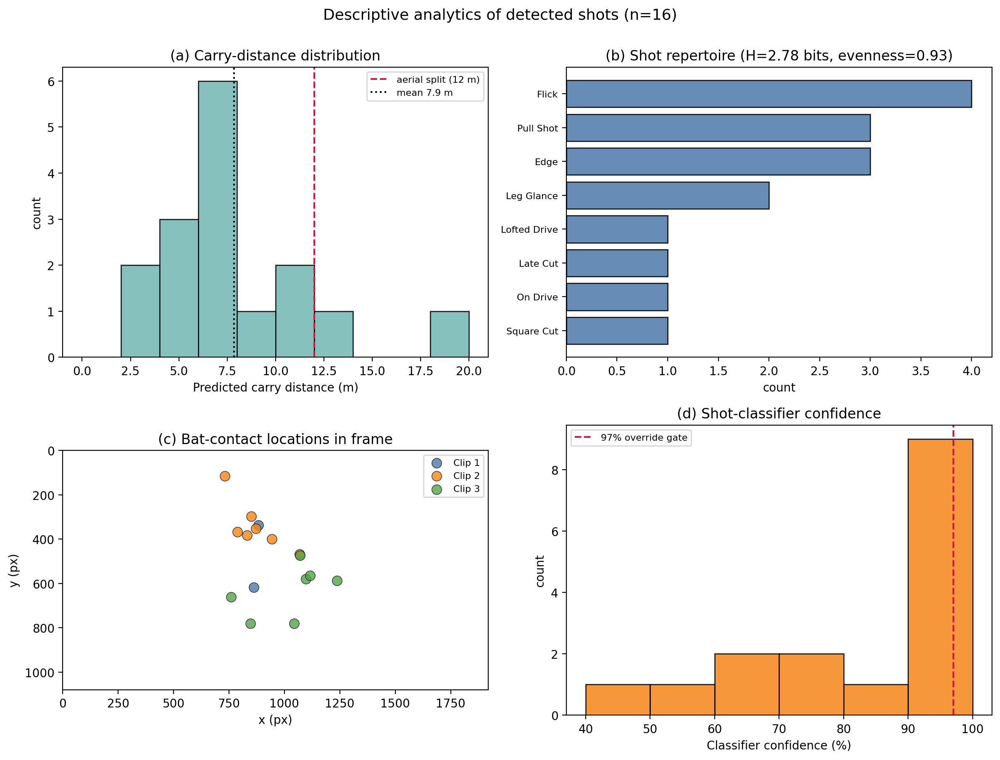

# System Performance & Evaluation

*Generated 2026-07-29. Runtime from an instrumented run of `src/test3.py`
(`PROFILE=1`, 1200 frames of `test_clip2.mp4`); profile saved to
`docs/figures/runtime_profile.json`. Descriptive stats:
`docs/figures/descriptive_stats.json`.*

## 1. Runtime / throughput

Measured on an **RTX 5060 Laptop GPU** at **1920×1080**, all models on GPU
(YOLOv8 detectors + YOLOv8m-pose via Ultralytics; EfficientNetB0+GRU shot
classifier via ONNX Runtime CUDA). Per-frame stages report the **median** to be
robust to the one-off ONNX/CUDA warm-up.

| Stage | Model | Median (ms) | Throughput | Runs |
| --- | --- | --- | --- | --- |
| Ball detection | YOLOv8 | 36.5 | 27 FPS | every frame |
| Bat detection | YOLOv8n | 3.8 | 260 FPS | every frame |
| Pose estimation | YOLOv8m-pose | 9.7 | 103 FPS | every frame |
| Visualisation + encode | — | 8.0 | — | every frame |
| **End-to-end** | — | **58.0** | **17.2 FPS** | every frame |
| Shot classifier | EfficientNetB0+GRU | 39.9 / event | — | event-triggered (7 in 1200 frames) |

**Key points for the paper:**

- **The ball detector is the bottleneck** — 36.5 ms, 63% of the per-frame
  compute and, on its own, over the 33.3 ms real-time budget. Bat, pose, and the
  visualisation overhead are comparatively cheap.
- **The shot classifier is not a per-frame cost.** It runs only on a contact
  window (7 times in 1200 frames here), and its steady-state cost is 39.9 ms per
  event (the mean of 898 ms in the raw log is a single ONNX/CUDA first-call
  compilation; excluded from the steady-state figure). Amortised over all frames
  it adds only **≈0.23 ms/frame**.
- **End-to-end throughput is ≈17 FPS**, i.e. **below** 30 FPS real-time at full
  HD. The system is real-time-capable *in principle* because the bottleneck is
  isolated to one stage.

**Clear optimisation path** (for the discussion/future-work section): the ball
detector is the single target. Options in rough order of effort — reduce YOLO
input resolution (e.g. 1280 or 960 px), export to TensorRT/FP16, or run ball
detection on a strided subset of frames with Kalman interpolation between (the
tracker already interpolates gaps ≤5 frames). Halving ball-detector time would
put the pipeline at ~30 FPS.



**Fig. Z.** Pipeline runtime profile. **(a)** median per-frame compute budget as a
stacked bar; the ball detector alone exceeds the 30 FPS budget (dashed line).
**(b)** per-stage throughput; only the ball detector and the end-to-end pipeline
fall below 30 FPS.

## 2. Descriptive analytics of detected shots (n = 16)

- **Carry distance:** mean 7.85 m, median 7.13 m (SD 4.23), range 2.5–19.7 m;
  14 ground / 2 aerial (split at 12 m). The lone Lofted Drive (19.7 m) is the
  clear aerial outlier.
- **Shot repertoire:** 8 distinct shot types over 16 events; Flick most frequent
  (25%). Shannon entropy **2.78 of 3.00 bits (evenness 0.93)** — a very even,
  varied stroke distribution rather than one or two dominant shots.
- **Classifier confidence:** median 96.2%, but bimodal — 44% of events at ≥97%
  (the EfficientNet-override band) and 25% below 70%. On `test_clip2` the CNN
  overrode the geometry angle on **2 of 7** classified contacts (28.6%).



**Fig. W.** Descriptive analytics: **(a)** carry-distance distribution,
**(b)** shot repertoire with Shannon entropy, **(c)** bat-contact locations in
the frame (clustered around the batsman's crease), **(d)** classifier-confidence
distribution with the 97% override gate.

## 3. Detection accuracy — precision / recall *(pending ground truth)*

The analytics above describe **what the system output**; a credible systems paper
also needs **whether the output is correct**. The scaffolding is in place:

- `scripts/eval_events.py` — matches detected events to hand-labelled contacts
  within a ±1 s tolerance and reports precision / recall / F1 plus shot-name
  accuracy.
- `docs/eval/ground_truth_template.csv` — label one row per real bat-contact per
  clip.
- `docs/eval/detections_reference.csv` — the 16 system detections listed for
  cross-checking (do not copy — label independently).

Run once labelled:

```bash
python scripts/eval_events.py \
    --gt docs/eval/ground_truth.csv \
    --events events_clip1.json events_clip2.json events_clip3.json \
    --clips clip1 clip2 clip3 --tol 1.0
```

*Prior manual note (memory): on `test_clip2`, 7 events for 6 real balls → 1 false
positive (precision ≈ 0.86); a full labelled evaluation across all three clips is
the remaining step to report proper precision/recall/F1.*
